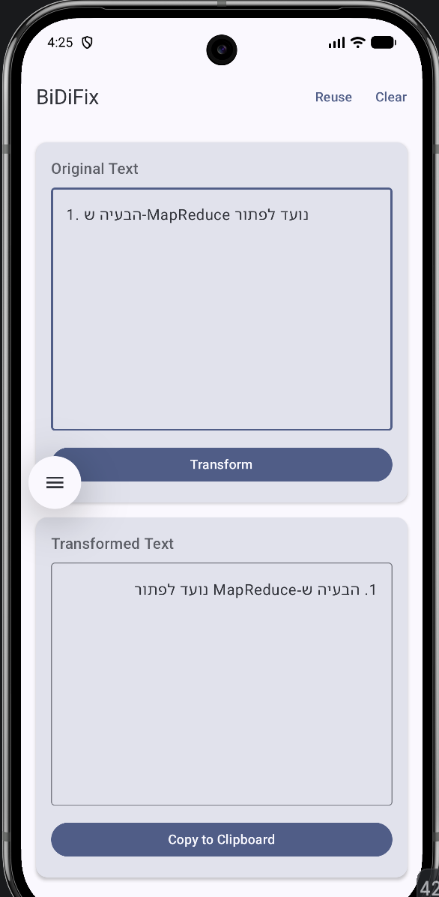

# BiDiFix

BiDiFix is a small Android app that repairs the display of **mixed Hebrew/English text** by
inserting *invisible* Unicode bidirectional control characters. It **does not translate**
text and **does not change spelling** — it only adds direction-control characters so that
punctuation, brackets, numbers and Latin identifiers render where they logically belong.

Paste text (or share it from another app), press **Transform**, and copy the corrected
result. The corrected string carries the invisible controls with it, so it renders
correctly when pasted into other apps.

---

## Example



The input is a Hebrew sentence that embeds the English term `MapReduce` and a leading list
number:

- **Original Text** (top): shown in raw logical order, so you can see the problem — the
  numbered prefix `1.` and the English `MapReduce` collide with the surrounding Hebrew.
- **Transformed Text** (bottom): after pressing **Transform**, `MapReduce` is wrapped in an
  LTR isolate and the Hebrew prefix `ש-` stays attached to it, so the whole line reads
  correctly right-to-left: `1. הבעיה ש-MapReduce נועד לפתור`.

No visible character was added, removed, or reordered — only invisible direction controls.

---

## What is Bidi (bidirectional) text?

Hebrew and Arabic are written right-to-left (RTL); English is written left-to-right (LTR).
When both appear in one line, the software must decide, for every character, which
direction it belongs to. The rules for this are the
**Unicode Bidirectional Algorithm (UBA)**.

### Why mixed Hebrew + English breaks

The UBA works well for letters, but *neutral* characters — spaces, commas, periods,
brackets, quotes — have no direction of their own. They take their direction from their
neighbours. In mixed text the "wrong" neighbour often wins, so you see:

- A final period jumping to the **left** (start) of an RTL sentence.
- A comma appearing on the **wrong side** of an English list inside a Hebrew sentence.
- Parentheses or quotes flipping so they no longer surround their content.
- An English identifier "leaking" its direction into the Hebrew words around it.

None of the letters are actually wrong — only their *placement* is. The fix is to tell the
algorithm, explicitly, where each run begins and ends.

### RTL/LTR direction vs. reversing a string

A common but wrong "fix" is to reverse the characters of a string, or to only flip the
UI's text alignment. **BiDiFix never does this.** Reversing corrupts the logical order of
the text (copy it elsewhere and it is broken); flipping alignment only changes appearance
in one view. Instead BiDiFix keeps every visible character in its original logical order
and inserts *formatting controls* that the standard UBA understands everywhere.

---

## The control characters

| Char | Name | Role |
|------|------|------|
| `LRM` | Left-to-Right Mark | Zero-width strong LTR character; nudges neutral placement. |
| `RLM` | Right-to-Left Mark | Zero-width strong RTL character; nudges neutral placement. |
| `LRI` | Left-to-Right Isolate | Opens an LTR run **isolated** from its surroundings. |
| `RLI` | Right-to-Left Isolate | Opens an RTL run isolated from its surroundings. |
| `FSI` | First-Strong Isolate | Opens a run whose direction is auto-detected. |
| `PDI` | Pop Directional Isolate | Closes the nearest `LRI`/`RLI`/`FSI`. |
| `LRE` | Left-to-Right Embedding | Legacy LTR embedding (not emitted). |
| `RLE` | Right-to-Left Embedding | Legacy RTL embedding (not emitted). |
| `PDF` | Pop Directional Formatting | Closes `LRE`/`RLE`/`LRO`/`RLO`. |
| `LRO`/`RLO` | Overrides | Force a direction; **avoided** — they reorder text. |

### Why isolates are preferred

An **isolate** (`LRI`/`RLI`/`FSI` … `PDI`) treats the wrapped run as a single neutral
object: its direction cannot leak out, and outside direction cannot leak in. Embeddings
(`LRE`/`RLE`) do leak at their boundaries, and overrides (`LRO`/`RLO`) can visually reorder
characters. BiDiFix therefore emits **only isolates and marks**, and every opening control
always has its matching `PDI`.

---

## What BiDiFix does, step by step

Implemented in [`BidiTransformer`](app/src/main/java/com/example/bidifix/bidi/BidiTransformer.kt):

1. **Normalise controls** — strip previously inserted isolates/marks so the transform is
   idempotent (`transform(transform(t)) == transform(t)`).
2. **Split into paragraphs**, preserving the exact line breaks.
3. **Detect base direction** of each paragraph from its first strong character (UBA P2/P3).
4. **Classify** every character via `Character.getDirectionality` into LTR / RTL / number /
   neutral (see [`BidiTextAnalyzer`](app/src/main/java/com/example/bidifix/bidi/BidiTextAnalyzer.kt)).
5. **Fold numbers** that belong to a Latin token (URLs, versions, `MainActivity.kt`) into
   that token, keeping it atomic; standalone numbers stay weak.
6. **Pair matched brackets** (UBA rule N0): for every `()`, `[]`, `{}`, `<>` pair, both
   brackets take the direction of their inner content, so a bracketed expression such as
   `GNU (Gnu's Not Unix)` is wrapped as one unit instead of having its closing bracket
   split off into the surrounding direction.
7. **Resolve neutrals** to the surrounding direction, or to the base direction when they
   sit between opposite runs — this is what keeps commas, dots inside URLs, quotes and
   brackets in the right place.
8. **Wrap** each maximal run whose direction is opposite to the base in a matching isolate.
9. **Anchor terminal punctuation** with an `RLM`/`LRM` when a sentence ends with an
   opposite-direction isolate followed by a period/comma, so the punctuation stays at the
   visual end.
10. **Validate** that all controls are balanced.

The output always preserves the original visible characters exactly; only invisible
controls are added.

---

## Receiving shared / selected text

Declared in [`AndroidManifest.xml`](app/src/main/AndroidManifest.xml) and handled in
[`MainActivity`](app/src/main/java/com/example/bidifix/MainActivity.kt) +
[`ShareIntentParser`](app/src/main/java/com/example/bidifix/util/ShareIntentParser.kt):

- **`ACTION_SEND`** with `text/plain` — BiDiFix appears in the Android **Share Sheet**;
  text is read from `Intent.EXTRA_TEXT`.
- **`ACTION_PROCESS_TEXT`** with `text/plain` — BiDiFix appears in the **text-selection
  toolbar**; text is read from `Intent.EXTRA_PROCESS_TEXT`.

Both **cold start** (`onCreate`) and **already-running** (`onNewIntent`, with
`launchMode="singleTop"`) are handled. Received text is placed in the input field and
**not** transformed automatically — the user presses **Transform**.

---

## Copying the result

The output panel offers two copy actions:

- **Copy to Clipboard** — copies the exact transformed string, *including* the invisible
  bidi controls. Use this for "dumb" renderers that do not run a full bidi algorithm
  (some code editors, chat inputs, PDF fields), where the marks are what fix the display.
- **Copy plain (no marks)** — strips every bidi control and copies only the visible
  characters, in their original logical order. Use this for apps that already do bidi well
  (e.g. **Microsoft Word**, Google Docs): they render the logical text correctly on their
  own, and stripping the controls avoids stray "?"/box glyphs from editors that display the
  control characters instead of honouring them.

The invisible controls *are* the correction, so the plain copy relies on the receiving app
to apply its own bidi. Most modern word processors do; simpler text fields may not.

---

## Design & theming

The app uses a single, centralized Material 3 theme with a fixed brand palette (dynamic
color is disabled) and automatic light/dark switching via the system setting.

- **All colors live in [`Color.kt`](app/src/main/java/com/example/bidifix/ui/theme/Color.kt)**
  — screens and components never hard-code hex values; they read from
  `MaterialTheme.colorScheme` or from `BiDiTheme.colors`.
- Material's `ColorScheme` has no slot for the two distinct panel surfaces, so those (plus
  success/warning/accent/border) are provided as **semantic colors** (`BidiSemanticColors`)
  through a `CompositionLocal` in
  [`Theme.kt`](app/src/main/java/com/example/bidifix/ui/theme/Theme.kt).
- Component roles: app **background** for the screen, **surface** for the top app bar, the
  **Input Text Surface** / **Transformed Text Surface** for the two panels, **Primary** for
  the Transform button, **Secondary** for Copy, **Accent** for focus/highlights, **Success**
  for the copy confirmation, and **Error** reserved for real errors.
- The two panels are distinguished by more than color — each has its own title and subtitle
  — so the UI does not rely on color alone.

The adaptive launcher icon
([`ic_launcher_foreground.xml`](app/src/main/res/drawable/ic_launcher_foreground.xml) +
[`ic_launcher_background.xml`](app/src/main/res/drawable/ic_launcher_background.xml)) shows
two opposing arrows — a left-to-right run and a right-to-left run — on the brand indigo,
representing bidirectional text.

---

## Architecture

Single-activity Jetpack Compose app with `ViewModel` + `StateFlow`:

```
bidi/      BidiCharacters, BidiTextAnalyzer, BidiTransformer, SampleInputs   (pure JVM, unit-tested)
ui/        MainScreen, components/TextPanel, theme/ (Color, Theme, Type), Previews
viewmodel/ MainViewModel + MainUiState (immutable, StateFlow)
util/      ClipboardHelper, ShareIntentParser
```

The bidi logic has **no Android dependencies**, so it is unit-tested in isolation. The UI
contains no transformation logic — it only observes state and calls the ViewModel, and all
colors come from the centralized theme.

---

## Running

Requirements: Android Studio (or the Android SDK) with **compileSdk 37**, JDK 21+.

```bash
./gradlew assembleDebug          # build the debug APK
./gradlew installDebug           # install on a connected device/emulator
```

Or open the project in Android Studio and press **Run**.

### Running the unit tests

```bash
./gradlew testDebugUnitTest
```

Test reports are written to `app/build/reports/tests/testDebugUnitTest/index.html`.
The tests in
[`BidiTransformerTest`](app/src/test/java/com/example/bidifix/bidi/BidiTransformerTest.kt)
and [`BidiAnalyzerTest`](app/src/test/java/com/example/bidifix/bidi/BidiAnalyzerTest.kt)
assert on **exact Unicode code points**, using the debug helpers in
[`TestUnicodeHelpers`](app/src/test/java/com/example/bidifix/bidi/TestUnicodeHelpers.kt)
(`codePointsDebug()`, `controlsDebug()`) so invisible characters are visible in failures.

---

## Known limitations

BiDiFix is a **heuristic** corrector, not a full UBA reimplementation:

- It reasons about tokens and paragraph base direction; it applies a pragmatic subset of
  the UBA (base direction, neutral resolution, matched-bracket pairing/N0, isolate
  wrapping) rather than the full recursive algorithm.
- Arabic and other RTL scripts are treated as RTL, but the app is tuned for Hebrew/English.
- Deeply nested mixed brackets/quotes may not always match a hand-tuned expectation.
- It preserves legacy embeddings/overrides (`LRE`/`RLE`/`PDF`/`LRO`/`RLO`) in input but
  normalises (re-generates) isolates and marks, so isolates you added by hand may be
  regenerated.
- It does not translate, transliterate, or change any visible character — including
  straight vs. curly quotes.

When in doubt, the transformer fails safe: it never reorders or drops visible text, and it
never emits an unbalanced control sequence.
